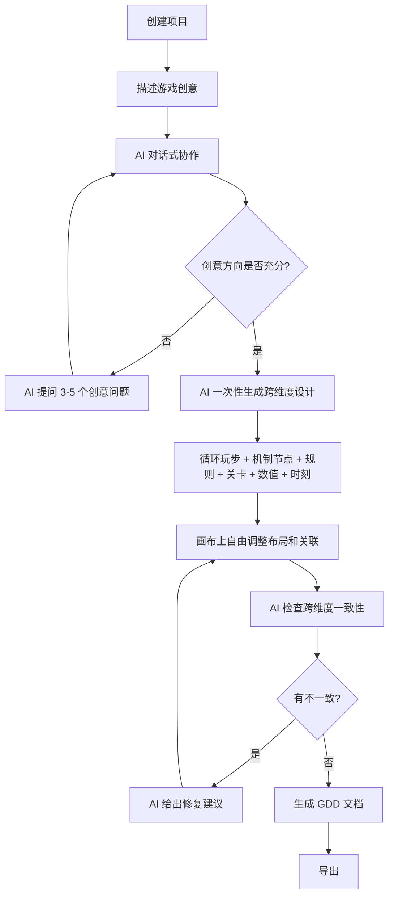
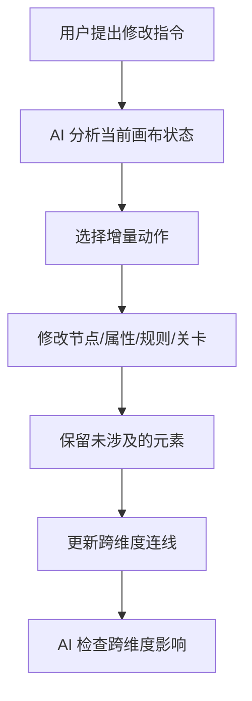

# 玩法设计平台 — 产品需求文档（PRD）

## 1. 产品概述

玩法设计平台是一个面向独立开发者与小团队的 **AI 驱动游戏玩法设计工作台**。它将游戏设计中的核心循环、机制网络、规则系统、关卡流程、数值平衡、设计文档等所有维度**深度融合为一个统一的无限画布**，让设计师在一个空间内完成从创意到文档的全流程工作。

### 核心设计理念：游戏是一个整体

游戏设计不是"先做机制、再做数值、最后写文档"的流水线，也不是"机制模块、数值模块、文档模块"的拼装积木。游戏是一个有机整体——核心循环定义"玩家反复做什么"，机制网络实现循环的底层系统，规则把机制翻译成可读的 IF-THEN，关卡承载循环和机制的体验容器，数值量化所有设计的参数，文档把一切编织成团队可读的说明书。

因此，平台**没有"模块"概念，没有 Tab 切换，没有分页面**。所有设计元素——一个循环玩步、一个机制节点、一条规则、一个关卡、一个属性、一段文档——都是无限画布上**平等的、自由的可拖拽卡片**，元素之间可以任意连线，跨维度关联直接可视化。

- **解决问题**：玩法设计工具割裂（Excel + 脑图 + Notion），设计维度之间缺乏关联，修改一处看不到对其他维度的影响
- **目标用户**：独立开发者、1-10 人小团队、游戏策划学习者
- **差异化**：统一无限画布 + AI 驱动设计——所有设计维度在一个空间内，AI 看到全部设计上下文，主动检查跨维度一致性
- **产品价值**：让设计师从"在多个工具间切换"升级为"在一个空间内统揽全局"

## 2. 设计哲学

### 2.1 为什么是无限画布

传统设计工具把不同维度的设计放在不同的页面/Tab 中——机制在"机制设计页"，数值在"数值设计页"，文档在"文档页"。设计师被迫在脑中维护跨维度映射："这个 condition 节点对应哪条规则？""这个关卡的难度匹配数值曲线吗？"

无限画布打破了这种割裂。所有设计元素在同一个空间中同时可见，设计师可以自由排列它们的布局，把相关的元素放在一起，在元素间画连线表达关联。类似 Figma 之于 UI 设计，平台之于游戏玩法设计——**一个空间统揽全局**。

### 2.2 为什么没有"模块"

如果把循环、机制、规则、关卡、数值、文档做成 6 个"模块"（即使放在一个画布上也是 6 个"块容器"），用户看到的还是"分类"——循环步骤被关在"循环块"里，机制节点被关在"机制块"里。

平台彻底消除"容器"概念。每个设计元素都是画布上独立的卡片，无论它是循环玩步还是数值属性，都享有相同的交互方式：拖拽移动、自由排列、任意连线、选中编辑。元素的"类型"只是渲染样式的区别，不是空间隔离的理由。

### 2.3 跨维度关联可视化

画布上的元素之间有自动检测的连线，展示跨维度关联：
- 循环玩步 ↔ 机制节点（label 匹配）
- 机制 condition ↔ 规则 IF-THEN（关键词匹配）
- 机制 attribute ↔ 数值属性（name 匹配）
- 关卡 ↔ 高光时刻（timing 匹配）
- 数值属性 ↔ GDD 段落（内容引用）

设计师一眼就能看到"这个循环玩步对应哪些机制节点""这条规则引用了哪个属性"——无需切换页面，无需脑中映射。

### 2.4 AI 看到全部

因为所有设计元素在同一个画布上，AI 助手的上下文天然完整。AI 可以：
- 看到全部设计元素，理解游戏全貌
- 主动检查跨维度一致性（"循环中的玩步在机制网络中缺少对应节点"）
- 一次性生成跨所有维度的完整设计
- 在修改建议中考虑对其他维度的影响

## 3. 画布元素类型

画布上的所有设计元素分为以下类型。注意：这些类型仅用于渲染样式和属性编辑，**不代表"模块"或"分类"**。

### 3.1 元素类型总览

| 类型 | 说明 | 主题色 | 典型内容 |
|------|------|--------|---------|
| 循环玩步 (loop-step) | 核心循环的一个步骤 | 自定义色 | "击杀敌人""获得战利品""升级强化" |
| 高光时刻 (moment) | 玩家情绪的峰谷标注 | #F59E0B | "第一次 Boss 战（紧张+兴奋 9/10）" |
| 机制节点 (node) | 游戏系统的一个组成部分 | 按类型着色 | "造成伤害(event)""HP池(pool)" |
| 规则 (rule) | IF-THEN 条件规则 | #F59E0B | "IF HP<30% THEN 角色逃跑" |
| 交互结果 (matrix-cell) | 两个元素间的交互关系 | #10B981 | "火 × 水 = 蒸发（伤害×2）" |
| 关卡节点 (level-node) | 一个关卡/Boss/过场 | #EF4444 | "史莱姆平原（难度2，15分钟）" |
| 数值属性 (attribute) | 一个数值属性 | #10B981 | "HP = 100""攻击力 ← @等级 * 10 + 50" |
| 文档段落 (doc-section) | GDD 的一个标题/段落 | #8B5CF6 | "## 核心机制" |

### 3.2 元素交互

所有类型的元素享有统一的交互方式：
- **拖拽移动**：拖拽卡片到画布上任何位置
- **选中编辑**：点击选中，右侧面板自动渲染对应类型的编辑器
- **自由连线**：元素之间可以手动连线，也有自动检测的关联连线
- **折叠/展开**：卡片可折叠为紧凑模式
- **双击编辑**：双击进入内联编辑模式

## 4. 功能能力

### 4.1 无限画布

| 能力 | 说明 |
|------|------|
| Pan/Zoom | 鼠标拖拽空白区域平移，滚轮缩放（0.25~2.0），以鼠标位置为中心 |
| 网格背景 | 极淡圆点网格，随缩放调整 |
| 适应视图 | 自动缩放使所有元素可见 |
| 布局持久化 | 元素位置自动保存到 localStorage（per project） |
| 重置布局 | 恢复默认网格排列 |

### 4.2 创建工具栏（左侧）

左侧面板是"创建工具"——不是"模块导航"。用户从这里创建任何类型的元素：

```
创建设计元素

  玩法
  ├── 循环玩步 — 玩家反复做什么的一个步骤
  ├── 高光时刻 — 标注玩家的情绪高峰
  └── 机制节点 — 游戏系统的一个组成部分

  规则
  ├── 规则 — IF-THEN 条件规则
  └── 元素交互 — 两个元素间的交互关系

  关卡
  └── 关卡节点 — 一个关卡/Boss/过场

  数值
  └── 属性 — 一个数值属性（HP/攻击力等）

  文档
  └── 文档段落 — GDD 的一个标题/段落
```

分组仅用于组织创建按钮，**不代表"模块"或"分类"**。

### 4.3 统一属性编辑器（右侧）

右侧面板根据选中元素的类型，自动渲染对应的编辑器：
- 选中循环玩步 → 玩步编辑器（标签、玩家动作、情绪、颜色）
- 选中高光时刻 → 时刻编辑器（标题、情绪强度、时机、类型、时长）
- 选中机制节点 → 节点属性面板（label、type、description、引用属性）
- 选中规则 → 规则编辑器（IF、THEN、分类、优先级）
- 选中关卡节点 → 关卡编辑器（label、type、难度、时长、门控）
- 选中数值属性 → 属性编辑器（name、value、公式）
- 选中文档段落 → 段落编辑器（title、content）

### 4.4 跨维度连线

画布上元素之间的连线分为两类：

**同维度内连线**（来自原始数据的关系）：
- 机制节点之间的边（如 event → action）
- 关卡节点之间的流程边（如 level → boss）
- 循环玩步之间的顺序连线

**跨维度关联连线**（自动检测）：
- 循环玩步 → 匹配的机制节点（label 关键词匹配）
- 机制 condition → 规则 IF-THEN（条件关键词匹配）
- 机制 attribute → 数值属性（name 匹配）
- 关卡 → 高光时刻（timing 范围匹配）
- 数值属性 → GDD 段落（内容引用检测）
- 规则 → 交互矩阵（元素名引用）

连线带标签显示关联类型和匹配数量，如"3 玩步匹配""2 属性引用"。

### 4.5 AI 能力

AI 助手看到画布上全部设计元素的上下文，提供以下能力：

| 能力 | 说明 |
|------|------|
| 统一设计生成 | 从创意描述一次性生成跨所有维度的完整初步设计 |
| 对话式协作 | 先提问理解创意方向，再生成设计 |
| 跨维度一致性检查 | 主动指出"循环中的玩步在机制网络中缺少对应节点"等问题 |
| 增量修改 | 增量修改现有设计，不破坏已有成果 |
| AI 导师 | 检测到设计问题时，用新人能听懂的语言解释并给修复建议 |
| GDD 生成 | 从画布上所有设计素材生成完整的 GDD 文档 |
| 平衡分析 | 分析数值平衡，检查 10 个反模式 |
| 灵感扩展 | 把一句话灵感扩展为可落地的设计方向 |
| 参考推荐 | 推荐同类游戏案例、设计书籍、通用原则 |

### 4.6 其他能力

| 能力 | 说明 |
|------|------|
| 命令面板 | Cmd+K 快速执行命令 |
| 全局搜索 | Cmd+P 搜索所有项目中的设计元素 |
| 设计快照 | 保存当前设计状态，支持版本对比 |
| 引擎导出 | 导出为 Unity / Godot / JSON 配置 |
| 蒙特卡洛模拟 | 对数值方案跑 1000 次模拟 |
| 经济演化模拟 | 模拟经济系统 1000+ 步长期演化 |
| 难度曲线对标 | 与 6 款经典游戏的难度曲线对比 |
| 反模式检测 | 自动检测 10 个常见设计反模式 |
| 演示模式 | 全屏展示设计 |
| 灵感看板 | 收集和管理设计灵感 |
| 试玩预览 | 模拟玩家体验流程 |

## 5. 数据模型

### 5.1 设计元素

平台管理以下设计元素（存储在 IndexedDB 中）：

| 元素 | 表名 | 关键字段 |
|------|------|---------|
| 核心循环 | coreLoops | name, loopType(core/secondary/meta), steps[] |
| 循环玩步 | (LoopStep in coreLoops) | label, playerAction, emotion, color, order |
| 高光时刻 | gameMoments | title, emotion(1-10), timing(0-100), type, duration |
| 机制图 | mechanismGraphs | name, type |
| 机制节点 | graphNodes | label, type(40种), description, refAttributeId |
| 机制边 | graphEdges | source, target, type(17种) |
| 规则 | gameRules | title, condition, action, category, priority, enabled |
| 交互矩阵 | interactionMatrices | name, elements[], interactions[] |
| 交互结果 | (InteractionCell in matrices) | elementA, elementB, result, type |
| 关卡流程 | levelFlows | name, nodes[], edges[] |
| 关卡节点 | (LevelNode in flows) | label, type(7种), difficulty, duration, gates[] |
| 数值表 | numericSheets | name |
| 数值属性 | attributes | name, type, value, parentId |
| 公式 | formulas | attributeId, expression, description |
| 文档 | gddDocuments | name |
| 文档段落 | docSections | title, content, type, order |

### 5.2 画布布局

元素在画布上的位置存储在 localStorage 中（key = `canvas-elements-${projectId}`），不修改数据模型。首次出现的元素自动分配网格位置。

## 6. 用户界面设计

### 6.1 设计风格

**整体风格**：专业工具风格，灵感来自 Figma / Linear / Notion 的混合体。

- **主题**：深色为主（Dark First），提供浅色切换
- **主色调**：深墨蓝底色（#0E1525）+ 青柠色强调（#A3E635）
- **布局**：三栏布局（左创建工具 + 中无限画布 + 右属性编辑）
- **画布**：极淡圆点网格背景，元素卡片紧凑（180x80~100）
- **连线**：贝塞尔曲线，带箭头和标签

### 6.2 页面清单

| 页面 | 说明 |
|------|------|
| 工作台首页 | 项目列表、新建项目、最近编辑 |
| 设计工作台 | 无限画布 + 创建工具栏 + 属性编辑器 + AI 助手 |
| 项目概览 | 项目仪表盘、设计进度、反模式检查 |
| 设置页 | AI 模型配置、API Key、主题、数据管理 |

### 6.3 设计工作台布局

```
┌──────────────────────────────────────────────────────────┐
│  顶部栏：返回 | 项目名 | 概览 | AI助手 | 搜索 | 快照 | 导出 │
├──────────┬──────────────────────────────┬────────────────┤
│          │                              │                │
│ 创建工具  │     无限画布                  │  属性编辑器     │
│          │                              │                │
│ + 玩法    │  [击杀敌人]──→[造成伤害]      │  选中元素的     │
│   玩步    │      │            │           │  属性编辑       │
│   时刻    │      ↓            ↓           │                │
│   节点    │  [紧张9/10]  [攻击力=@Lv*10]  │  (自动适应     │
│          │                │              │   元素类型)     │
│ + 规则    │  [IF HP<30]   [HP=100]       │                │
│   规则    │     │              │          │                │
│   交互    │     ↓              ↓          │                │
│          │  [第1关]      [# 核心机制]     │                │
│ + 关卡    │                              │                │
│ + 数值    │  [+] [-] [适应] [重置] 80%   │                │
│ + 文档    │                              │                │
│          │                              │                │
├──────────┴──────────────────────────────┴────────────────┤
│  状态栏：循环3 · 时刻8 · 节点15 · 规则5 · 关卡8 · 属性12  │
└──────────────────────────────────────────────────────────┘
```

### 6.4 关键交互

- **拖拽元素**：拖拽卡片移动位置，delta 除以 zoom 为实际位移
- **缩放画布**：滚轮缩放，以鼠标位置为中心
- **平移画布**：拖拽空白区域
- **创建元素**：左侧工具栏点击类型 → 新元素出现在画布中央
- **选中编辑**：点击元素 → 右侧自动渲染对应编辑器
- **双击编辑**：双击元素进入内联编辑
- **快捷键**：Cmd+K 命令面板、Cmd+P 全局搜索、Cmd+Z 撤销
- **自动保存**：所有操作自动写入 IndexedDB + localStorage

## 7. 核心流程

### 7.1 从创意到完整设计



### 7.2 增量修改流程



## 8. 反模式检测

平台内置 10 个反模式检查器，自动检测：

1. **节点过多无分层**：机制节点 >20 且维度覆盖 <4
2. **数值前期太陡**：1-10 级数值增长 >10 倍
3. **GDD 无核心循环**：文档缺少"核心循环"描述
4. **无资源消耗机制**：经济系统只有产出无消耗
5. **奖励过于均匀**：所有奖励等值
6. **公式过于复杂**：嵌套超过 3 层
7. **无失败惩罚**：没有 penalty 节点
8. **节点类型误用**：如用 resource 表示状态
9. **数值无上限**：属性可能无限增长
10. **GDD 冗长无结构**：段落 >20 且无标题分层

## 9. 技术依赖

- **前端**：React 18 + TypeScript + Vite
- **状态管理**：Zustand
- **本地存储**：Dexie.js (IndexedDB) + localStorage
- **AI**：多模型适配（OpenAI / Claude / 通义 / DeepSeek）
- **样式**：Tailwind CSS
- **图标**：Lucide React
- **公式引擎**：mathjs
- **富文本**：TipTap
