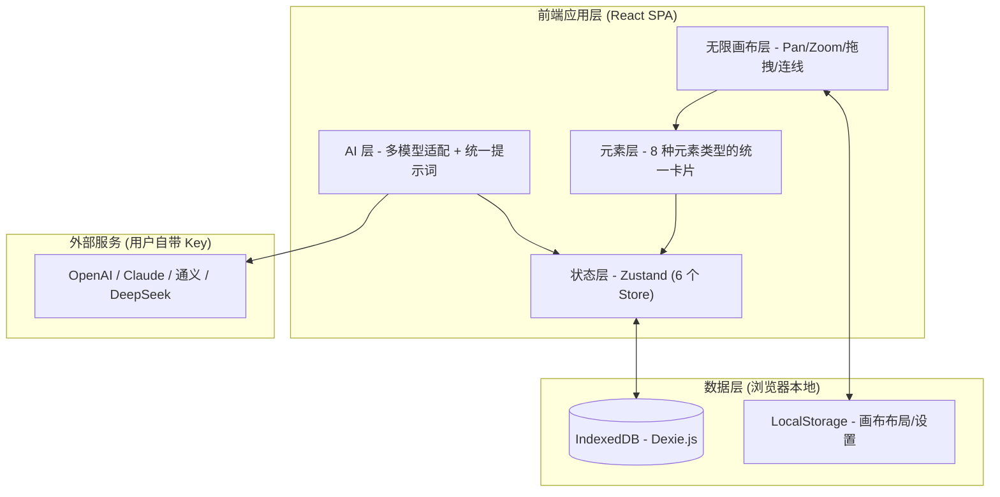

# 玩法设计平台 — 技术架构文档

## 1. 架构概述

平台采用**纯前端 SPA 架构**，无后端服务器，数据全部存储在浏览器本地 IndexedDB。AI 能力通过用户自带的 API Key 直接调用云端 LLM 服务。

### 核心架构理念：统一无限画布

平台的核心是一个**无限画布**——所有设计元素（循环玩步、机制节点、规则、关卡、属性、文档段落等）作为平等的可拖拽卡片放在同一个画布上，没有"模块"或"分类"概念。



### 架构原则

- **统一空间**：所有设计元素在同一个无限画布上，没有模块分割
- **本地优先**：所有项目数据存 IndexedDB，离线可用
- **AI 可插拔**：通过统一 AI Client 适配多家模型
- **元素平等**：不同类型的元素享有相同的交互方式（拖拽、选中、连线、编辑）
- **自动持久化**：状态变更自动写入 IndexedDB，画布布局写入 localStorage

## 2. 技术栈

平台为**纯前端 SPA**，无后端。以下按职责分组列出全部依赖及选型理由。

### 2.1 核心框架与构建

| 技术 | 版本 | 用途 | 选型理由 |
|------|------|------|----------|
| React | 18.3 | UI 框架 | 生态最成熟，Concurrent 渲染为大画布与 AI 流式输出提供基础；团队熟悉度高 |
| TypeScript | 5.6 | 类型安全 | 8 种元素类型 + 6 个 Store + AI 工具 schema 结构复杂，静态类型是重构与协作的必要保障 |
| Vite | 6.3 | 开发与构建 | ESM 原生 dev server 启动快；esbuild 预构建让 elkjs 这类大依赖按需懒加载不拖慢首屏 |
| React Router | 7.3 | 客户端路由 | 项目内多页面（工作台/概览/设置）与向后兼容旧路由需要声明式路由表 |

### 2.2 画布与可视化（平台核心）

| 技术 | 版本 | 用途 | 选型理由 |
|------|------|------|----------|
| @xyflow/react (React Flow) | 12.3 | **无限画布节点图** | 平台核心。官方原生支持 Pan/Zoom/连线/自定义节点/MiniMap/Controls，v12 的 Loose 连接模式允许任意 Handle 互联，是构建机制图编辑器的工业级方案，远胜自研 canvas |
| elkjs | 0.11 | **自动布局算法** | React Flow 无内置布局。ELK 是官方对比表中唯一同时支持动态节点尺寸+子流布局+边路由的库；bundled 版内置 5 种算法（stress/layered/force/radial/mrtree），其中 stress 专为稠密多对多图设计，契合游戏机制节点杂乱连接的场景 |
| recharts | 2.15 | 数据图表 | 属性区间条、情绪曲线、等级流程等 SVG 可视化；基于 React 组件式 API，与画布节点内嵌图表契合 |
| html-to-image | 1.11 | 画布截图导出 | 纯前端将 DOM 转为 PNG，无需服务端渲染，满足设计稿分享需求 |

### 2.3 状态与数据

| 技术 | 版本 | 用途 | 选型理由 |
|------|------|------|----------|
| Zustand | 5.0 | 全局状态管理 | 6 个 Store 管理元素/AI/项目/设置等。Zustand 极简、无 Provider 嵌套、天然支持 selector 避免重渲染，比 Redux 样板少；hook 式 API 与 React 贴合 |
| zundo | 2.3 | 撤销/重做 | Zustand 官方中间件，自动记录状态快照实现画布操作的 undo/redo，无需手写命令栈 |
| Dexie.js | 4.0 | IndexedDB 封装 | 本地优先架构要求所有项目数据离线可用。Dexie 提供 Promise 化查询 API 与版本迁移机制，比原生 IndexedDB 易用，支持复杂索引 |
| zod | 3.24 | 运行时数据校验 | AI 工具调用的参数 schema、表单输入校验。与 TypeScript 类型推导联动，一处定义类型与校验同源 |

### 2.4 编辑器与内容

| 技术 | 版本 | 用途 | 选型理由 |
|------|------|------|----------|
| TipTap | 2.10 | 富文本编辑（GDD 文档） | 基于 ProseMirror，提供可扩展的富文本能力用于编写游戏设计文档；插件化架构支持占位符等扩展 |
| dompurify | 3.2 | HTML 净化 | AI 输出与用户粘贴内容需渲染为 HTML，dompurify 防 XSS，是浏览器端 sanitize 的事实标准 |
| mathjs | 14.0 | 公式解析引擎 | 游戏属性系统需支持 `damage = atk * (1 - def/100)` 类公式。mathjs 支持表达式求值与单位换算，配合白名单字符校验防注入 |

### 2.5 AI 能力

| 技术 | 版本 | 用途 | 选型理由 |
|------|------|------|----------|
| gpt-tokenizer | 2.9 | Token 计数 | 多模型（OpenAI/Claude/通义/DeepSeek）的上下文窗口不同，需精确计数以控制 prompt 长度，避免超限报错 |

> AI 多模型适配通过自研 [aiClient.ts](file:///Users/linlong/projects/games/game_design/src/services/aiClient.ts) 实现，支持流式输出、工具调用（Agentic 多轮循环，最大 8 轮）、Claude 兼容，无需第三方 AI SDK。

### 2.6 UI 与样式

| 技术 | 版本 | 用途 | 选型理由 |
|------|------|------|----------|
| Tailwind CSS | 3.4 | 原子化 CSS | 设计系统颜色/间距统一通过 config 令牌管理；原子类直接在 JSX 内书写，迭代快；与 clsx/tailwind-merge 配合实现条件样式 |
| Radix UI | - | 无障碍基础组件 | dialog/dropdown/select/switch/tabs/toast/tooltip 共 7 个。Radix 提供 WAI-ARIA 完整实现与键盘导航，unstyled 不锁死样式，与 Tailwind 搭配最佳 |
| clsx + tailwind-merge | - | className 合并 | clsx 条件拼接 + tailwind-merge 解决冲突类覆盖，是 Tailwind 项目的标准组合 |
| lucide-react | 0.511 | 图标库 | Tree-shaking 友好的 SVG 图标，体积小、风格统一 |
| framer-motion | 11.15 | 声明式动画 | 节点状态过渡、面板进出等微交互；声明式 API 与 React 贴合 |
| gsap | 3.15 | 时间轴动画 | 复杂动画序列（引导流程、性能预算演示）需要精确时间轴控制，gsap 比声明式动画更可控 |
| date-fns | 4.1 | 日期格式化 | 模块化按需引入，比 moment 体积小 |

### 2.7 工具库

| 技术 | 版本 | 用途 | 选型理由 |
|------|------|------|----------|
| nanoid | 5.0 | ID 生成 | 元素/项目/连接均需唯一 ID。nanoid 比 uuid 短且 URL 安全，无依赖 |

### 2.8 开发工具（devDependencies）

| 技术 | 版本 | 用途 |
|------|------|------|
| ESLint | 9 | 代码规范，配合 typescript-eslint + react-hooks + react-refresh 插件 |
| PostCSS + autoprefixer | - | CSS 后处理，为 Tailwind 提供管道 |
| vite-tsconfig-paths | 5.1 | 解析 `@/` 路径别名 |
| babel-plugin-react-dev-locator | 1.0 | 开发态点击页面元素定位源码 |

### 2.9 选型总原则

1. **本地优先**：Dexie + IndexedDB + LocalStorage，无后端依赖，离线可用
2. **画布为王**：React Flow + ELK 构成平台核心，所有设计元素在同一无限画布
3. **类型同源**：TypeScript + Zod 让类型定义与运行时校验一处维护
4. **按需加载**：elkjs 等 重依赖通过 dynamic import 懒加载，不进首屏 bundle
5. **生态成熟优先**：每个库均为该领域事实标准（React Flow/Zustand/Tiptap/mathjs/dompurify），降低维护风险

## 3. 路由设计

| 路由 | 用途 |
|------|------|
| `/` | 工作台首页（项目列表） |
| `/project/:projectId` | 项目内（默认重定向到 workspace） |
| `/project/:projectId/workspace` | **设计工作台（无限画布）** |
| `/project/:projectId/dashboard` | 项目概览 |
| `/project/:projectId/mechanism` | 旧路由（向后兼容） |
| `/project/:projectId/numeric` | 旧路由（向后兼容） |
| `/project/:projectId/document` | 旧路由（向后兼容） |
| `/project/:projectId/gameplay` | 旧路由（向后兼容） |
| `/project/:projectId/level` | 旧路由（向后兼容） |
| `/project/:projectId/rules` | 旧路由（向后兼容） |
| `/settings` | 设置页 |

## 4. 无限画布架构

### 4.1 画布层级

```
InfiniteCanvas（pan/zoom 容器）
├── 网格背景层（CSS radial-gradient）
├── ConnectionLayer（SVG 贝塞尔曲线连线）
├── ElementCard × N（元素卡片）
└── CanvasToolbar（缩放/适应/重置）
```

### 4.2 画布组件

| 组件 | 文件 | 职责 |
|------|------|------|
| InfiniteCanvas | `features/canvas/InfiniteCanvas.tsx` | Pan/zoom 容器，网格背景，事件处理 |
| ElementCard | `features/canvas/ElementCard.tsx` | 统一元素卡片，8 种类型自适应渲染 |
| ConnectionLayer | `features/canvas/ConnectionLayer.tsx` | SVG 连线层，贝塞尔曲线+箭头+标签 |
| CanvasToolbar | `features/canvas/CanvasToolbar.tsx` | 缩放控制工具栏 |
| CreateToolbar | `features/canvas/CreateToolbar.tsx` | 左侧创建工具栏 |
| UnifiedPropertyPanel | `features/canvas/UnifiedPropertyPanel.tsx` | 右侧统一属性编辑器 |
| UnifiedWorkspace | `features/canvas/UnifiedWorkspace.tsx` | 主组件，编排所有元素和连线 |

### 4.3 元素类型系统

```typescript
type CanvasElementType =
  | "loop-step"      // 循环玩步
  | "moment"         // 高光时刻
  | "node"           // 机制节点
  | "rule"           // 规则
  | "matrix-cell"    // 交互结果
  | "level-node"     // 关卡节点
  | "attribute"      // 数值属性
  | "doc-section";   // 文档段落

interface CanvasElement {
  key: string;        // `${type}-${id}`
  type: CanvasElementType;
  id: string;
  title: string;
  subtitle?: string;
  color: string;
  icon: string;
  rawType?: string;   // 如节点类型 "event"
  rawCategory?: string; // 如规则分类 "combat"
}
```

### 4.4 画布布局持久化

```typescript
// localStorage key: canvas-elements-${projectId}
interface ElementLayout {
  position: { x: number; y: number };
}

// 首次出现的元素自动分配网格位置
function getDefaultPosition(index: number): { x: number; y: number } {
  const col = index % 5;
  const row = Math.floor(index / 5);
  return { x: 40 + col * 220, y: 40 + row * 160 };
}
```

### 4.5 连线检测

```typescript
function detectConnections(elements: CanvasElement[], ...): Connection[] {
  // 同维度内连线
  // - 机制节点之间的边（graphEdges）
  // - 关卡节点之间的流程边
  // - 循环玩步之间的顺序

  // 跨维度关联
  // - 循环玩步 ↔ 机制节点（label 匹配）
  // - 机制 condition ↔ 规则 IF-THEN（关键词匹配）
  // - 机制 attribute ↔ 数值属性（name 匹配）
  // - 关卡 ↔ 高光时刻（timing 匹配）
  // - 数值属性 ↔ GDD 段落（内容引用）
  // - 规则 → 交互矩阵（元素名引用）
}
```

## 5. 数据模型

### 5.1 IndexedDB 表结构（Dexie Schema v5）

```typescript
db.version(5).stores({
  projects: 'id, name, updatedAt',
  mechanismGraphs: 'id, projectId, type',
  graphNodes: 'id, graphId, type',
  graphEdges: 'id, graphId, source, target',
  numericSheets: 'id, projectId',
  attributes: 'id, sheetId, parentId',
  formulas: 'id, sheetId, attributeId',
  gddDocuments: 'id, projectId',
  docSections: 'id, docId, order',
  coreLoops: 'id, projectId',
  gameMoments: 'id, projectId',
  gameRules: 'id, projectId',
  interactionMatrices: 'id, projectId',
  levelFlows: 'id, projectId',
  aiConfigs: 'key',
});
```

### 5.2 核心数据类型

```typescript
// 核心循环
interface CoreLoop {
  id: string;
  projectId: string;
  name: string;
  description: string;
  steps: LoopStep[];
  loopType: "core" | "secondary" | "meta";
}

interface LoopStep {
  id: string;
  label: string;
  playerAction: string;
  emotion: string;
  color: string;
  order: number;
}

// 高光时刻
interface GameMoment {
  id: string;
  projectId: string;
  title: string;
  description: string;
  emotion: number;      // 1-10
  emotionLabel: string;
  timing: number;        // 0-100
  type: "story" | "combat" | "exploration" | "social" | "economy" | "custom";
  duration: number;      // 秒
}

// 规则
interface GameRule {
  id: string;
  projectId: string;
  title: string;
  condition: string;     // IF
  action: string;        // THEN
  category: "combat" | "movement" | "economy" | "social" | "progression" | "custom";
  priority: number;      // 1-10
  enabled: boolean;
}

// 交互矩阵
interface InteractionMatrix {
  id: string;
  projectId: string;
  name: string;
  elements: string[];
  interactions: InteractionCell[];
}

interface InteractionCell {
  elementA: string;
  elementB: string;
  result: string;
  type: "reaction" | "buff" | "debuff" | "cancel" | "custom";
  description?: string;
}

// 关卡流程
interface LevelFlow {
  id: string;
  projectId: string;
  name: string;
  nodes: LevelNode[];
  edges: LevelEdge[];
}

interface LevelNode {
  id: string;
  label: string;
  type: "level" | "boss" | "cutscene" | "hub" | "secret" | "tutorial" | "ending";
  difficulty: number;    // 1-10
  duration: number;      // 分钟
  gates: string[];
}

// 机制节点（40 种类型）
interface GraphNode {
  id: string;
  graphId: string;
  type: string;          // 40 种：event/action/state/condition/...
  label: string;
  data: { description?: string; refAttributeId?: string };
  position: { x: number; y: number };
}

// 数值属性
interface Attribute {
  id: string;
  sheetId: string;
  name: string;
  type: "number" | "string" | "bool";
  value: string;
  parentId?: string;
}
```

## 6. 状态管理

### 6.1 Store 分层

```typescript
useProjectStore     // 项目列表与当前项目
useMechanismStore   // 机制图、节点、边
useNumericStore     // 数值表、属性、公式
useDocumentStore    // 文档、段落
useGameplayStore    // 核心循环、高光时刻
useRuleStore        // 规则、交互矩阵
useLevelStore       // 关卡流程
useUIStore          // UI 状态（面板折叠、主题、选中元素）
useHistoryStore     // 撤销/重做
useAIStore          // AI 配置与调用状态
```

### 6.2 画布选中状态

```typescript
// uiStore
interface UIState {
  selectedCanvasElement: CanvasElement | null;
  setSelectedCanvasElement: (el: CanvasElement | null) => void;
  leftPanelCollapsed: boolean;
  rightPanelCollapsed: boolean;
  aiPanelOpen: boolean;
  theme: "dark" | "light";
}
```

## 7. AI 架构

### 7.1 统一 AI 接口

```typescript
interface AIClient {
  provider: string;
  chat(messages: ChatMessage[], options?: ChatOptions): AsyncStream<Chunk>;
  validateKey(): Promise<boolean>;
}
```

### 7.2 提示词系统

提示词文件：`src/lib/aiPrompts.ts`

**SYSTEM_PROMPT 核心理念**：
- AI 理解平台的"无限画布"理念
- 所有设计元素在同一个画布上，AI 看到全部上下文
- AI 的核心职责是检查跨维度一致性

**Prompt Builder 函数**：

| 函数 | 用途 |
|------|------|
| `buildUnifiedDesignPrompt` | 一次性生成跨所有维度的完整设计 |
| `buildMechanismGenPrompt` | 生成机制网络 |
| `buildLoopGenPrompt` | 生成核心循环 |
| `buildMomentGenPrompt` | 生成高光时刻 |
| `buildRuleGenPrompt` | 生成规则 |
| `buildMatrixGenPrompt` | 生成交互矩阵 |
| `buildLevelGenPrompt` | 生成关卡流程 |
| `buildLevelReviewPrompt` | 评审关卡难度曲线 |
| `buildNumericGenPrompt` | 生成数值方案 |
| `buildBalanceAnalysisPrompt` | 分析数值平衡 |
| `buildGDDGenPrompt` | 生成 GDD 文档（注入所有维度素材） |
| `buildChatPrompt` | 对话（注入全部 6 维度上下文） |
| `buildMentorPrompt` | AI 导师（含跨维度建议） |
| `buildInspirationPrompt` | 灵感扩展 |
| `buildReferencePrompt` | 参考推荐 |

### 7.3 Action-JSON 协议

AI 通过 action-json 块提交结构化设计：

| Action | 用途 |
|--------|------|
| `apply_mechanism` | 全量应用机制图 |
| `apply_numeric` | 全量应用数值表 |
| `apply_gdd` | 全量应用 GDD 文档 |
| `apply_loops` | 应用核心循环 |
| `apply_moments` | 应用高光时刻 |
| `apply_rules` | 应用规则 |
| `apply_matrix` | 应用交互矩阵 |
| `apply_level_flow` | 应用关卡流程 |
| `update_node` | 增量修改节点 |
| `remove_node` | 增量删除节点 |
| `add_node_to_existing` | 增量添加节点 |
| `patch_formula` | 增量修改公式 |

## 8. 目录结构

```
game-design/
├── src/
│   ├── features/
│   │   ├── canvas/           # 无限画布（核心）
│   │   │   ├── InfiniteCanvas.tsx
│   │   │   ├── ElementCard.tsx
│   │   │   ├── ConnectionLayer.tsx
│   │   │   ├── CanvasToolbar.tsx
│   │   │   ├── CreateToolbar.tsx
│   │   │   ├── UnifiedPropertyPanel.tsx
│   │   │   ├── UnifiedWorkspace.tsx
│   │   │   └── useCanvasLayout.ts
│   │   ├── mechanism/        # 机制节点/边类型定义
│   │   ├── gameplay/         # 循环/时刻编辑器
│   │   ├── rules/            # 规则/矩阵编辑器
│   │   ├── level/            # 关卡编辑器
│   │   ├── numeric/          # 数值编辑器
│   │   ├── document/         # 文档编辑器
│   │   ├── ai/               # AI 面板/导师
│   │   ├── command/          # 命令面板
│   │   ├── search/           # 全局搜索
│   │   ├── snapshot/         # 设计快照
│   │   ├── dashboard/        # 项目概览
│   │   ├── export/           # 引擎导出
│   │   ├── presentation/     # 演示模式
│   │   ├── inspiration/      # 灵感看板
│   │   └── playtest/         # 试玩预览
│   ├── stores/               # Zustand stores
│   ├── lib/                  # aiClient, aiPrompts, utils
│   ├── types/                # TypeScript 类型
│   └── db/                   # Dexie 数据库
├── .trae/documents/          # 策划文档
│   ├── PRD.md
│   └── TechnicalArchitecture.md
└── package.json
```

## 9. 性能与体验

- **画布性能**：拖拽用 requestAnimationFrame 节流，缩放用 CSS transform
- **数据加载**：进入工作台时一次性加载所有维度数据
- **自动保存**：状态变更防抖写入 IndexedDB，画布布局防抖写入 localStorage
- **流式渲染**：AI 输出流式渲染，可中途停止
- **错误隔离**：模块级 Error Boundary
